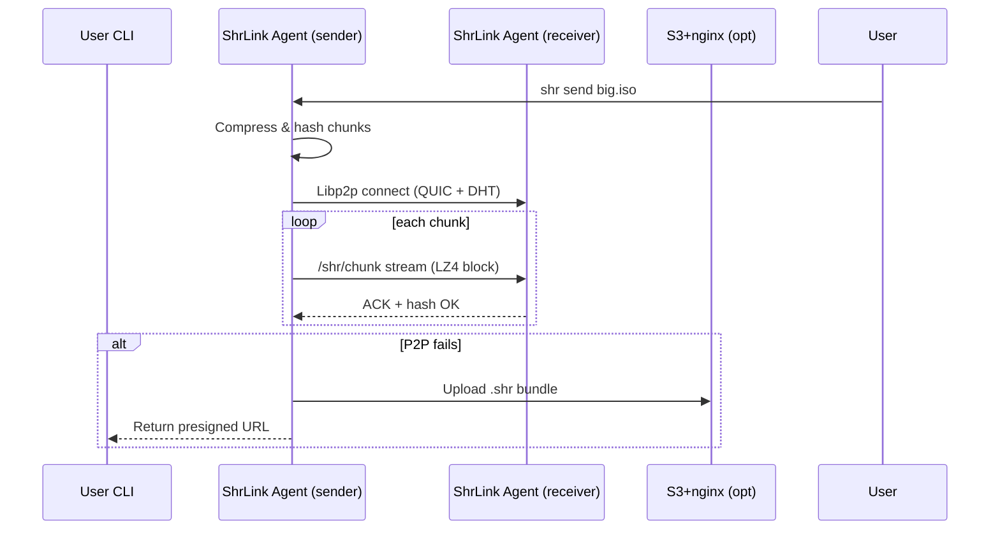

# ⚙️ Agent Specification (`agent.md`)

This document defines the **ShrLink Agent**—the background process that performs compression, peer discovery, transfer, and optional fallback upload for any file you share.

---

## 1. Responsibilities

| Layer                                 | Duty                                                  |
| ------------------------------------- | ----------------------------------------------------- |
| **Compression**                       | • Split input into 4 MiB blocks                       |
| • LZ4‑fast encode (acceleration = 1)  |                                                       |
| • Stream BLAKE3 hash alongside bytes  |                                                       |
| **Networking**                        | • Spawn libp2p host with QUIC transport               |
| • Register K‑DHT behaviour            |                                                       |
| • Handle AutoNAT + hole‑punch         |                                                       |
| **Transfer Logic**                    | • For each chunk: open QUIC stream `/shr/chunk/1.0.0` |
| • Retry w/ exponential back‑off       |                                                       |
| **Fallback**                          | • If no direct peers after `P2P_TIMEOUT` (5 s):       |
|     1. Upload `.shr` bundle to HTTP server     |                                                       |
|     2. Return presigned URL           |                                                       |
| **Integrity**                         | • Verify BLAKE3 on the fly                            |
| • Abort + request re‑send on mismatch |                                                       |
| **CLI / API**                         | • `shr send <file>`                                   |
| • \`shr recv \<peer‑url               | http-url>\`                                           |

---

## 2. High‑Level Sequence



---

## 3. Module Map (Rust Crates)

| Module        | Crate               | Notes                                      |
| ------------- | ------------------- | ------------------------------------------ |
| `compression` | `lz4_flex`          | `compress_prepend_size`, level 1           |
| `hash`        | `blake3`            | One‑pass chunk ID                          |
| `p2p`         | `libp2p`            | Features: `quic`, `kad`, `dns`, `auto-nat` |
| `cli`         | `clap`, `indicatif` | UX & progress bars                         |
| `fallback`    | `aws_sdk_s3`        | Signed URL (24 h)                          |

---

## 4. Config

```toml
[p2p]
bootstrap = [
  "/dns4/bootstrap.libp2p.io/tcp/443/quic-v1"
]
timeout_ms = 5000

[compression]
algorithm = "lz4"
block_size = 4194304 # 4 MiB
acceleration = 1

[fallback]
region = "us-east-1"
bucket = "shr-temp-links"
expiry_secs = 86400
```

---

## 5. CLI Cheatsheet

```bash
# Send (P2P preferred, S3 fallback)
shr send file.iso

# Receive via P2P link
echo "shr://12D3K.../f1c9..." | shr recv -

# Receive via HTTP fallback
shr recv https://d3bucket.example.com/tmp/XYZ.shr
```


